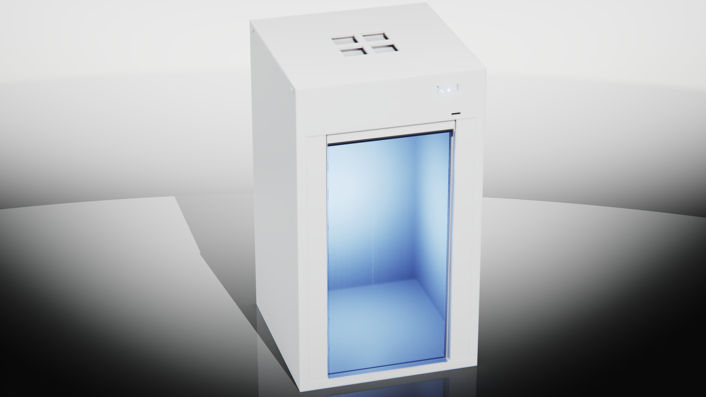
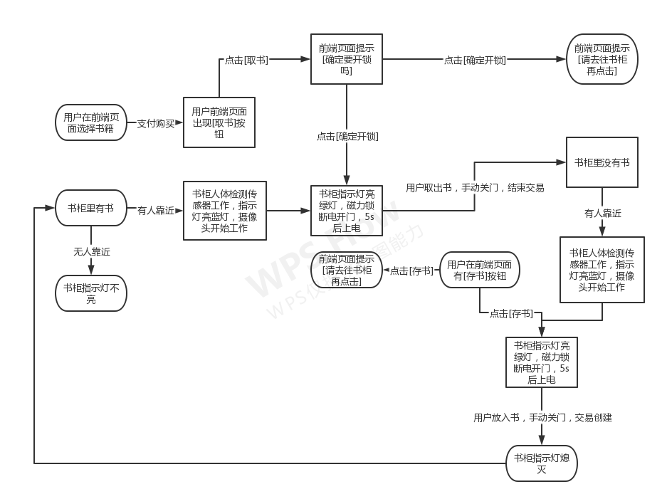

# 流浪计划 | WanderingPlan
---
## 日志 | Logs
>2022 03 25 
>>所有工程文件都已上传至Github
>>API文档已更新
>>代码注释已更新

>2022 03 24 
>>磁力锁模块开发成功上线
>>将摄像头模块移至第二阶段
>>3D建模完成
>>渲染工作完成

>2022 03 23 
>>AliOS-Things YiluMao回复：
>>您好，目前确实没有这个demo
>>短期也没有计划做这个
>>如果您有兴趣，可以考虑贡献一个案例到社区
>>如果需要技术支持，可以提issue获取

>2022 03 22 
>>购买升压模块

>2022 03 20 
>>向AliOS-Things提出Issue 申请发布一个Haas600基于UART2TTL传输的摄像头demo

>2022 03 19 
>>购买锂电池模块
>>购买圆形强力磁铁5块
>>购买杜邦线若干

>2022 03 18
>>LED灯模块开发成功上线
>>磁力锁模块调试出现问题

>2022 03 16 
>>购买磁力锁模块
>>购买LED灯模块
>>购买MOS模块

>2022 03 12 
>>人体检测模块开发上线成功
>>摄像头模块调试出现问题

>2022 03 09 
>>购买PIR模块
>>购买TTL串口摄像头模块
>>购买杜邦线若干

>2022 03 01 
>>Haas600成功上云
>>温度模块开发上线成功
>>GPS模块开发上线成功

>2021 12 31 
>>购买Haas600开发板

>2021 12 30 
>>项目正式立项
---
## 渲染图


---

## 计划阶段
### 第一阶段[书柜阶段][毕设阶段]
+ 温度模块 ✔
+ 人体检测模块 ✔
+ GPS模块 ✔
+ 磁力锁模块 ✔
+ 阿里云模块 ✔
### 第二阶段[货柜阶段][功能拓展及硬件精简阶段]
+ 摄像头模块
+ 太阳能电池模块
+ ...
---
## 业务逻辑流程图


---

## API使用示例[仅提供NodeJS版]

+ API名称：setLED
```javascript
const Client = require('aliyun-api-gateway').Client;
const UUID = require('uuid');

// 用appKey和appSecret初始化客户端

const client = new Client('您的<AppKey>', '您的<AppSecret>');

const Gateway = async ({url, apiVer, params, iotToken}) => {

    return await client.post(url, {
        data: {
            id: UUID.v1(), // 请求唯一标识，必填
            version: '1.0', // 协议版本，固定值1.0
            request: {
                iotToken, // iottoken，选填
                apiVer // api版本，必填
            },
            params: params || {} // 业务参数，必填
        },
        headers: {
            accept: 'application/json'
        },
        timeout: 3000        
    });

};

const params = {
    url: 'http://fcaea944ce554e968c4dc6acdd53033b-cn-shanghai.alicloudapi.com/a123spAe9pmMS0F4/bfx3LnoN6vcCkD',
    apiVer: '1.0.0',
    params: {
        // 接口参数
        
		"action":"node_bb4914c0",
		"green":1,
		"blue":1,
    }
}

Gateway(params)
    .then(res => console.log(res))
    .catch(res => console.log(res));

```
---
+ API名称：setLock
```javascript
const Client = require('aliyun-api-gateway').Client;
const UUID = require('uuid');

// 用appKey和appSecret初始化客户端

const client = new Client('您的<AppKey>', '您的<AppSecret>');

const Gateway = async ({url, apiVer, params, iotToken}) => {

    return await client.post(url, {
        data: {
            id: UUID.v1(), // 请求唯一标识，必填
            version: '1.0', // 协议版本，固定值1.0
            request: {
                iotToken, // iottoken，选填
                apiVer // api版本，必填
            },
            params: params || {} // 业务参数，必填
        },
        headers: {
            accept: 'application/json'
        },
        timeout: 3000        
    });

};

const params = {
    url: 'http://fcaea944ce554e968c4dc6acdd53033b-cn-shanghai.alicloudapi.com/a123spAe9pmMS0F4/bfM2zto9YGaVlU',
    apiVer: '1.0.0',
    params: {
        // 接口参数
        
		"action":"node_e9ae6510",
		"data":1,
    }
}

Gateway(params)
    .then(res => console.log(res))
    .catch(res => console.log(res));

```
---
+ API名称：getPIR
```javascript
const Client = require('aliyun-api-gateway').Client;
const UUID = require('uuid');

// 用appKey和appSecret初始化客户端

const client = new Client('您的<AppKey>', '您的<AppSecret>');

const Gateway = async ({url, apiVer, params, iotToken}) => {

    return await client.post(url, {
        data: {
            id: UUID.v1(), // 请求唯一标识，必填
            version: '1.0', // 协议版本，固定值1.0
            request: {
                iotToken, // iottoken，选填
                apiVer // api版本，必填
            },
            params: params || {} // 业务参数，必填
        },
        headers: {
            accept: 'application/json'
        },
        timeout: 3000        
    });

};

const params = {
    url: 'http://fcaea944ce554e968c4dc6acdd53033b-cn-shanghai.alicloudapi.com/a123spAe9pmMS0F4/bfu2i7sly5Pc8k',
    apiVer: '1.0.0',
    params: {
        // 接口参数
        
		"action":"node_730b6dc0",
    }
}

Gateway(params)
    .then(res => console.log(res))
    .catch(res => console.log(res));

```
---
+ API名称：getLockValue
```javascript
const Client = require('aliyun-api-gateway').Client;
const UUID = require('uuid');

// 用appKey和appSecret初始化客户端

const client = new Client('您的<AppKey>', '您的<AppSecret>');

const Gateway = async ({url, apiVer, params, iotToken}) => {

    return await client.post(url, {
        data: {
            id: UUID.v1(), // 请求唯一标识，必填
            version: '1.0', // 协议版本，固定值1.0
            request: {
                iotToken, // iottoken，选填
                apiVer // api版本，必填
            },
            params: params || {} // 业务参数，必填
        },
        headers: {
            accept: 'application/json'
        },
        timeout: 3000        
    });

};

const params = {
    url: 'http://fcaea944ce554e968c4dc6acdd53033b-cn-shanghai.alicloudapi.com/a123spAe9pmMS0F4/bfe4XmHpgjOXXA',
    apiVer: '1.0.0',
    params: {
        // 接口参数
        
		"action":"node_2b9116c0",
    }
}

Gateway(params)
    .then(res => console.log(res))
    .catch(res => console.log(res));

```
---
+ API名称：getGreenValue
```javascript
const Client = require('aliyun-api-gateway').Client;
const UUID = require('uuid');

// 用appKey和appSecret初始化客户端

const client = new Client('您的<AppKey>', '您的<AppSecret>');

const Gateway = async ({url, apiVer, params, iotToken}) => {

    return await client.post(url, {
        data: {
            id: UUID.v1(), // 请求唯一标识，必填
            version: '1.0', // 协议版本，固定值1.0
            request: {
                iotToken, // iottoken，选填
                apiVer // api版本，必填
            },
            params: params || {} // 业务参数，必填
        },
        headers: {
            accept: 'application/json'
        },
        timeout: 3000        
    });

};

const params = {
    url: 'http://fcaea944ce554e968c4dc6acdd53033b-cn-shanghai.alicloudapi.com/a123spAe9pmMS0F4/bf5Fp6rKIJR7u5',
    apiVer: '1.0.0',
    params: {
        // 接口参数
        
		"action":"node_d0e0d760",
    }
}

Gateway(params)
    .then(res => console.log(res))
    .catch(res => console.log(res));

```
---
+ API名称：getBlueValue
```javascript
const Client = require('aliyun-api-gateway').Client;
const UUID = require('uuid');

// 用appKey和appSecret初始化客户端

const client = new Client('您的<AppKey>', '您的<AppSecret>');

const Gateway = async ({url, apiVer, params, iotToken}) => {

    return await client.post(url, {
        data: {
            id: UUID.v1(), // 请求唯一标识，必填
            version: '1.0', // 协议版本，固定值1.0
            request: {
                iotToken, // iottoken，选填
                apiVer // api版本，必填
            },
            params: params || {} // 业务参数，必填
        },
        headers: {
            accept: 'application/json'
        },
        timeout: 3000        
    });

};

const params = {
    url: 'http://fcaea944ce554e968c4dc6acdd53033b-cn-shanghai.alicloudapi.com/a123spAe9pmMS0F4/bfbQxnHpJ25VtV',
    apiVer: '1.0.0',
    params: {
        // 接口参数
        
		"action":"node_93cbe5f0",
    }
}

Gateway(params)
    .then(res => console.log(res))
    .catch(res => console.log(res));

```
---
+ API名称：getLocation
```javascript
const Client = require('aliyun-api-gateway').Client;
const UUID = require('uuid');

// 用appKey和appSecret初始化客户端

const client = new Client('您的<AppKey>', '您的<AppSecret>');

const Gateway = async ({url, apiVer, params, iotToken}) => {

    return await client.post(url, {
        data: {
            id: UUID.v1(), // 请求唯一标识，必填
            version: '1.0', // 协议版本，固定值1.0
            request: {
                iotToken, // iottoken，选填
                apiVer // api版本，必填
            },
            params: params || {} // 业务参数，必填
        },
        headers: {
            accept: 'application/json'
        },
        timeout: 3000        
    });

};

const params = {
    url: 'http://fcaea944ce554e968c4dc6acdd53033b-cn-shanghai.alicloudapi.com/a123spAe9pmMS0F4/bfC2h9KdtEhecu',
    apiVer: '1.0.0',
    params: {
        // 接口参数
        
		"action":"node_fee4b250",
    }
}

Gateway(params)
    .then(res => console.log(res))
    .catch(res => console.log(res));

```
---
+ API名称：getTemp
```javascript
const Client = require('aliyun-api-gateway').Client;
const UUID = require('uuid');

// 用appKey和appSecret初始化客户端

const client = new Client('您的<AppKey>', '您的<AppSecret>');

const Gateway = async ({url, apiVer, params, iotToken}) => {

    return await client.post(url, {
        data: {
            id: UUID.v1(), // 请求唯一标识，必填
            version: '1.0', // 协议版本，固定值1.0
            request: {
                iotToken, // iottoken，选填
                apiVer // api版本，必填
            },
            params: params || {} // 业务参数，必填
        },
        headers: {
            accept: 'application/json'
        },
        timeout: 3000        
    });

};

const params = {
    url: 'http://fcaea944ce554e968c4dc6acdd53033b-cn-shanghai.alicloudapi.com/a123spAe9pmMS0F4/bfrpKKBq0783mF',
    apiVer: '1.0.0',
    params: {
        // 接口参数
        
		"action":"node_af145fb0",
    }
}

Gateway(params)
    .then(res => console.log(res))
    .catch(res => console.log(res));

```